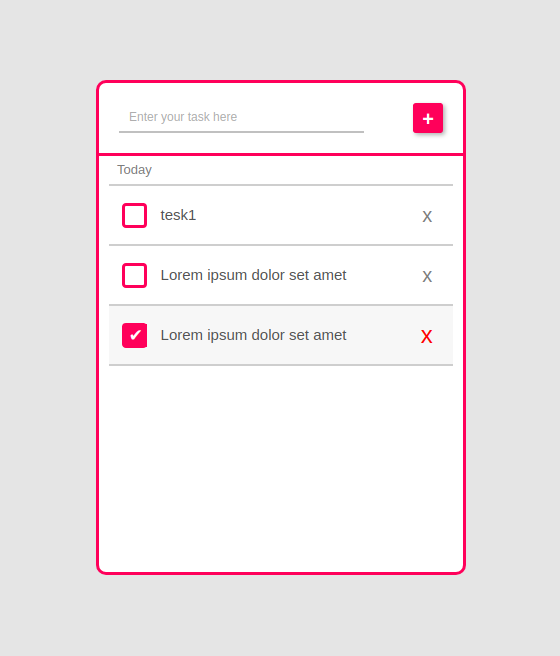

# To-do-app
To-do app using HTML|CSS|JS

# About the project 
This project was build using only HTML|CSS|JS and not have used any other third party libraries.User can enter the task in the application and when the task got completed he can mark it has done and if he dont want it anymore he can remove the task using "x" sign on the list.

# Screen shots of the project
* Staring interface when user opens the apllication 
  * 
* Interface when user bymistake enters submit without entering the task 
  * 
* Interface when user wants to delet the task or mark it has a checked 
  * 
 

